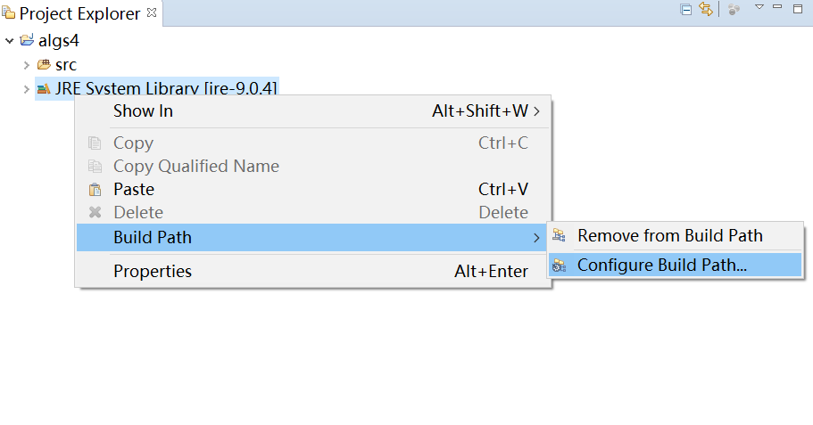
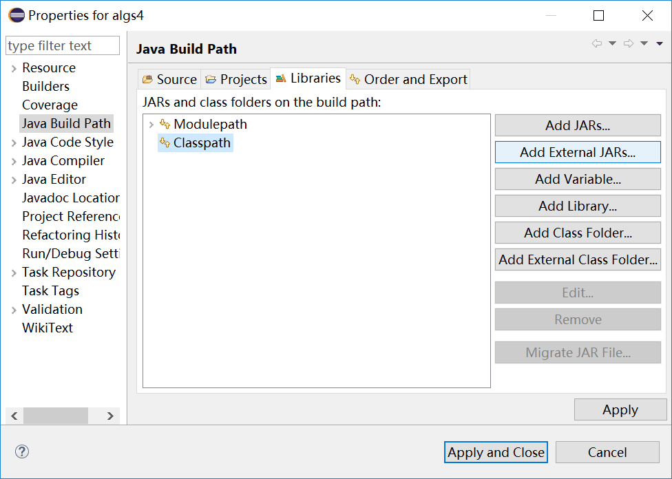
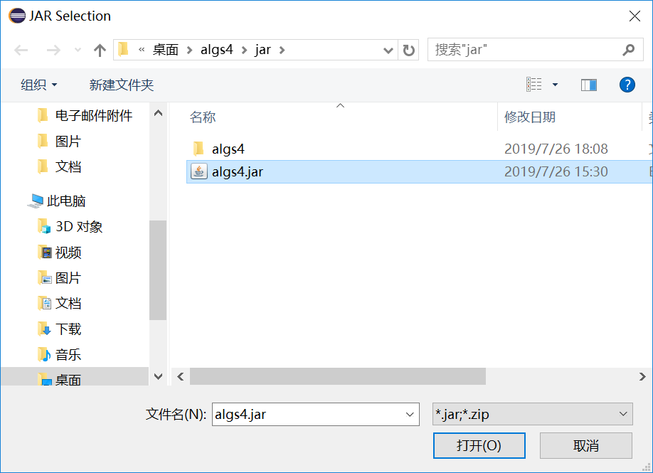
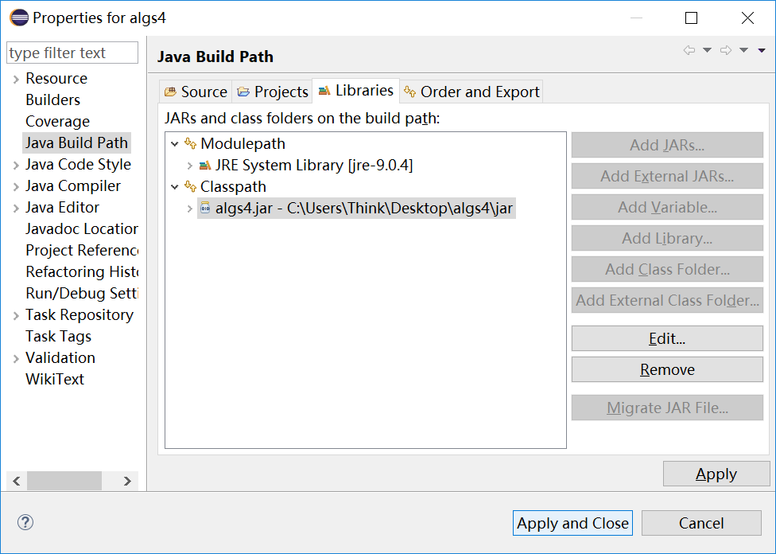
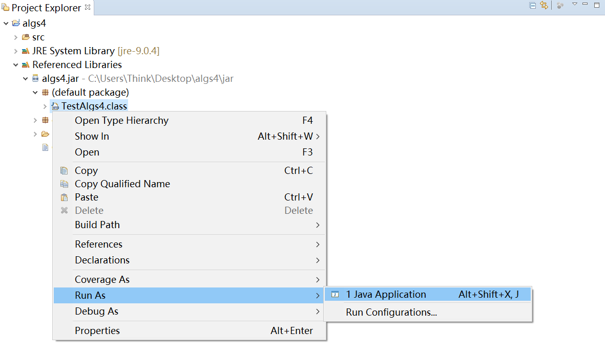

## 算法（第 4 版）

> Algorithms, 4th edition learning tour

### 相关资源

* [官方网站](https://algs4.cs.princeton.edu/home/)：包含**书本内容摘要**，**书本练习题答案**，**Web 练习题及解答**，**书本代码**，**书本所使用的数据集**，**书中所使用的库的 API 文档**，**课件**等等。
  * [Java Algorithms and Clients](https://algs4.cs.princeton.edu/code/)：
    * [javadoc](https://algs4.cs.princeton.edu/code/javadoc) API 文档查看
    * [algs4.jar](https://algs4.cs.princeton.edu/code/algs4.jar) 下载
    * [algs4-data.zip](https://algs4.cs.princeton.edu/code/algs4-data.zip) 数据集下载
    * 书中各种经典算法代码实现
    * 部分书本习题答案
* [kevin-wayne/algs4](https://github.com/kevin-wayne/algs4)：官方维护的 Github 仓库
* [jimmysuncpt/Algorithms - Github](https://github.com/jimmysuncpt/Algorithms)：国内某同学答案（较完整）
* [aistrate/AlgorithmsSedgewick - Github](https://github.com/aistrate/AlgorithmsSedgewick)：国外某同学答案

### 配置

> 官方提供了基于 IntelliJ 的 Java 编程环境配置教程：[Windows](https://lift.cs.princeton.edu/java/windows/)

由于我本地已经安装了 Eclipse，故选择使用 Eclipse 作为实验环境。

* Eclipse 如何导入 algs4.jar？

  <table>
    <tr>
      <td></td>
      <td></td>
    </tr>
    <tr>
      <td>
右键单击 JRE System Library -> Build Path -> 左键单击 Configure Build Path
</td>
      <td>
左键选中 Classpath，然后左键单击右侧 Add External JARs...
</td>
    </tr>
    <tr>
      <td></td>
      <td></td>
    </tr>
    <tr>
      <td>
选择已下载到本地的 algs4.jar
</td>
      <td>
可以看到 algs4.jar 已添加到 Classpath 中，最后左键单击 Apply and Close
</td>
    </tr>
    <tr>
      <td></td>
      <td></td>
    </tr>
    <tr>
      <td>
运行 algs4.jar 中提供的 TestAlgs4
</td>
      <td>
弹出以上窗口，窗口中 20 个小球不断运动且发生碰撞
</td>
    </tr>
  </table>

* Eclipse 下如何进行命令行重定向以及管道操作？

  * 命令行重定向：参考 [算法第四版所用到需要下载的库？ - 直引间引的回答 - 知乎](https://www.zhihu.com/question/36491917/answer/184510984) 或 [《算法》第4版(Algorithms Fourth Edition)在Eclipse下的重定向与管道问题](https://blog.csdn.net/huanghxyz/article/details/73730572)

  * 管道：网上未找到方法...

* Eclipse 中可以运行系统 shell/terminal 吗？

  要在 Eclipse 中运行系统 shell/terminal 需要额外安装其他软件，具体参考 [How to run system shell/terminal inside Eclipse? - Stack Overflow](https://stackoverflow.com/questions/44220993/how-to-run-system-shell-terminal-inside-eclipse/44220994)。

  PS：Eclipse 工具栏 Help -->  Install New Software... 进入 Stack Overflow 所提的页面，需要粘贴到 Work with: 输入栏中的网址为：`http://download.eclipse.org/releases/oxygen/`。安装完成后，按提示重启 Eclipse 即可。

