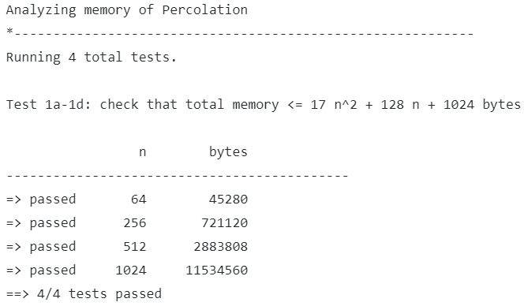
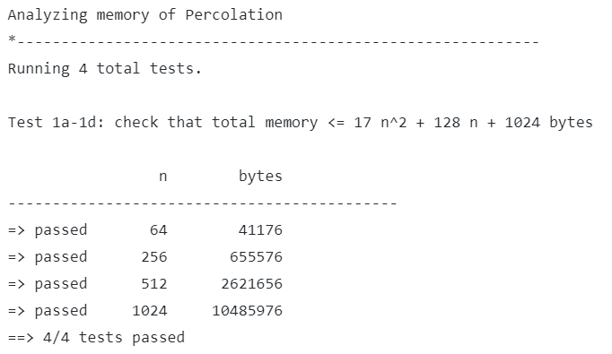

## Assignment1 - backwash in Percolation

> 作业网站：[Assignment1-Percolation](https://coursera.cs.princeton.edu/algs4/assignments/percolation/specification.php)，包含本次作业的说明，FAQ，相关的有用资源文件。

[TOC]

### backwash 问题

在作业网站的 [FAQ](https://coursera.cs.princeton.edu/algs4/assignments/percolation/faq.php) 中提到了一个叫做 backwash 的问题：

> **Q**: After the system has percolated, my `PercolationVisualizer` colors in light blue all sites connected to open sites on the bottom (in addition to those connected to open sites on the top). Is this “backwash” acceptable?
>
> **A**: No, this is likely a bug in `Percolation`. It is only a minor deduction (because it impacts only the visualizer and not the experiment to estimate the percolation threshold), so don’t go crazy trying to get this detail. However, many students consider this to be the most challenging and creative part of the assignment (especially if you limit yourself to one union–find object).
>
> 

正如上面的回答所说的，backwash 并不会影响到我们最终使用蒙特卡洛模拟所得到的结果 `p*` 的准确性，但 backwash 确实反映了所设计的 `Percolation` 是有 Bug 的。

在回答中，实际上已经~~暗示~~明示了你一种解决方案：especially if you limit yourself to one union–find object。

下面我们将介绍 4 中解决方案，其中方法 4 是我最后提交的答案，它是方法 1 和方法 3 的结合再改进。

### 解决 backwash 的方法

backwash 为什么会发生呢？搞清楚这个问题是解决 backwash 现象的关键。问题的答案是，**backwash 现象是虚拟底部节点 `virtualBottom` 带来的**。

为了能够快速判断 Percolation System（渗滤系统）是否是渗滤的，我们引入了虚拟顶部节点 `virtualTop` 和虚拟底部节点 `virtualBottom`。每次系统顶端的节点开启，就将其与 `virtualTop` 进行 `union`，每次系统底端的节点开启，就将其与 `virtualBottom` 进行 `union`。这样我们只需要判断 `virtualTop` 和 `virtualBottom` 是否 `connected`，就能知道系统是否是渗滤的。

引入虚拟节点的做法无疑要比“对于每个系统顶端节点判断其是否和底端某个节点 `connected` ”要高效的多。但同时它也带来了 backwash 问题。

那我们能否尝试只引入 `virtualTop` 呢？

**方法 1：只使用 `virtualTop`**

如果只使用虚拟顶部节点的话，要判断一个系统是否是渗滤的，我们就得对该虚拟顶部节点，判断其是否和底端某个节点 `connected`。这种方法是 $O(n)$ 的，相比“对于每个系统顶端节点判断其是否和底端某个节点 `connected` ”的 $O(n^2)$，要好了一些，但还可以继续改进。

**方法 2：使用两个 `WeightedQuickUnionUF`**

这种方法也即 FAQ 中回答里面提示的方法。我们使用两个 `WeightedQuickUnionUF`：`WQUUF1` 和 `WQUUF2`。

`WQQUF1` 带有 `virtualTop` 和 `virtualBottom`，其用于判断系统是否渗滤。

`WQQUF2` 只带有 `virtualTop` ，其用于处理 backwash 现象。

`WQQUF1` 和 `WQQUF2` 从头到尾执行几乎一样的 `union` 操作。

这种方法是不难想到的，但 `union` 操作本身是比较费时的，仅为了处理反洗现象，我们把相同的 `union` 操作执行了两次，似乎有点不那么优雅。

**方法 3：既不使用 `virtualTop` 也不使用 `virtualBottom`，对每个节点维护两个属性 `connectTop` 和 `connectBottom`**

该方法是我在网上找到的，在评估中能得到 :100: + Bonus。

这种方法的思想是，对于每次 `union(p, q)` 操作，我们都去检查：

* `connectTop`：

  * `p` 所在的树（连通分量）的根节点是否其 `connectTop` 为 true。
  * `q` 所在的树（连通分量）的根节点是否其 `connectTop` 为 true。

  但凡有一个为 true，那么两颗树（两个连通分量）合并以后，新树的根节点其 `connectTop` 也设为 true。可以看出，如果我们要判断一个节点是否和最顶行相连，只需要找到该节点所在的树的根节点，判断其根节点的 `connectTop` 属性是否为真即可，为真这说明该节点与最顶行相连，为假则不相连。

* `connectBottom`：

  * `p` 所在的树（连通分量）的根节点是否其 `connectBottom` 为 true。
  * `q` 所在的树（连通分量）的根节点是否其 `connectBottom` 为 true。

  但凡有一个为 true，那么两颗树（两个连通分量）合并以后，新树的根节点其 `connectBottom` 也设为 true。可以看出，如果我们要判断一个节点是否和最底行相连，只需要找到该节点所在的树的根节点，判断其根节点的 `connectBottom` 属性是否为真即可，为真这说明该节点与最底行相连，为假则不相连。

我们能看出来 `connectTop` 以及 `connectBottom` 属性的传播性，true 最开始是从哪来的呢？如果一个节点被打开，且发现该节点为最顶行的节点，那么其 `connectTop` 就会被设为 true；如果一个节点被打开，且发现该节点为最底行的节点，那么其 `connectTop` 就会被设为 true。

这种方法是如何判断系统是否渗滤的呢？它维护了一个实例变量 `percolateFlag` ，每次 `open` 打开一个节点，我们都要将该节点与多个其他节点尝试进行 `union` 并配置 `union` 后所得新树的根节点的 `connectTop` 与 `connectBottom` 属性，我们在这些操作都完成以后，检查是新树的根节点 `connectTop` 与 `connectBottom` 是否都为 true，若是这系统渗滤，否则不渗滤。

方法 3 的完整代码见最后。

**方法 4：结合方法 1 与方法 3，只使用 `virtualTop` 且对每个节点只维护属性 `connectBottom`**

方法 3 似乎也不那么优雅，它虽然能取得 :100:+ Bonus，但有点复杂。

引入虚拟节点是很好的思想，我们知道 backwash 现象是由 `virtualBottom` 造成的，那么结合方法 3，我们是否可以保留 `virtualTop` 并对节点维护属性 `connectBottom` 呢？这就是方法 4。

对于 `connectBottom` 的维护依然和方法 3 差不多，但引入虚拟节点使得代码简洁了非常多：

* 我们不需要再维护 `connectTop` 了，要知道，`connectTop` 和 `connectBottom` 其实是意义相近的两个概念，维护一个就够呛了，现在少一个就少了很多维护的代码（少了很多 `union` 和 `find` 操作）。更重要地，我们还省下了创建 `connectTop[]` 数组的空间！相当于方法 4 所占用的空间是方法 3 的 2/3。
* 判断系统是否渗滤也变得非常简单，我们只需要判断 `virtualTop` 所在的树的根节点其 `connectBottom` 属性是否是 true 的！

方法 4 的完整代码见最后。

**效果对比**

| 方法 3                                            | 方法 4                                            |
| ------------------------------------------------- | ------------------------------------------------- |
|  |  |
|  |  |
|           |           |


### 代码

**方法 3**

```java

package assignment1;

import edu.princeton.cs.algs4.WeightedQuickUnionUF;

public class Percolation {

    private boolean[] site;
    private boolean[] connectTop;
    private boolean[] connectBottom;
    private final int size;
    private int numberOfOpenSites = 0;
    private final WeightedQuickUnionUF uf;
    private boolean percolateFlag = false;

    public Percolation(int n) {
        validate(n);
        this.size = n;
        this.uf = new WeightedQuickUnionUF(n * n);
        this.site = new boolean[n * n];
        this.connectTop = new boolean[n * n];
        this.connectBottom = new boolean[n * n];
    }

    public void open(int row, int col) {
        validate(row, col);
        int index = xyTo1D(row, col);
        if (!site[index]) {
            site[index] = true;
            numberOfOpenSites++;
        }
        boolean topFlag = false;
        boolean bottomFlag = false;

        if (row == 1) {
            topFlag = true;
        }
        if (row == size) {
            bottomFlag = true;
        }
        // Optimize if already connected to top/bottom with short-circuit evaluation
        // connect with down site
        if (row < size && site[index + size]) {
            if (!topFlag && connectTop[uf.find(index + size)] || connectTop[uf.find(index)]) {
                topFlag = true;
            }
            if (connectBottom[uf.find(index + size)] || connectBottom[uf.find(index)]) {
                bottomFlag = true;
            }
            uf.union(index, index + size);
        }
        // connect with up site
        if (row > 1 && site[index - size]) {
            if (!topFlag && connectTop[uf.find(index - size)] || connectTop[uf.find(index)]) {
                topFlag = true;
            }
            if (!bottomFlag && connectBottom[uf.find(index - size)] || connectBottom[uf.find(index)]) {
                bottomFlag = true;
            }
            uf.union(index, index - size);
        }
        // connect with right site
        if (col < size && site[index + 1]) {
            if (!topFlag && connectTop[uf.find(index + 1)] || connectTop[uf.find(index)]) {
                topFlag = true;
            }
            if (!bottomFlag && connectBottom[uf.find(index + 1)] || connectBottom[uf.find(index)]) {
                bottomFlag = true;
            }
            uf.union(index, index + 1);
        }
        // connect with left site
        if (col > 1 && site[index - 1]) {
            if (!topFlag && connectTop[uf.find(index - 1)] || connectTop[uf.find(index)]) {
                topFlag = true;
            }
            if (!bottomFlag && connectBottom[uf.find(index - 1)] || connectBottom[uf.find(index)]) {
                bottomFlag = true;
            }
            uf.union(index, index - 1);
        }

        connectTop[uf.find(index)] = topFlag;
        connectBottom[uf.find(index)] = bottomFlag;
        if (!percolateFlag && connectTop[uf.find(index)] && connectBottom[uf.find(index)]) {
            percolateFlag = true;
        }
    }

    public boolean isOpen(int row, int col) {
        validate(row, col);
        return site[xyTo1D(row, col)];
    }

    /** A full site is an open site that can be connected to an open site in the
     *  top row via a chain of neighboring (left, right, up, down) open sites.
     */
    public boolean isFull(int row, int col) {
        validate(row, col);
        return connectTop[uf.find(xyTo1D(row, col))];
    }

    public int numberOfOpenSites() {
        return numberOfOpenSites;
    }

    /** Introduce 2 virtual sites (and connections to top and bottom).
     *  Percolates if virtual top site is connected to virtual bottom site.
     */
    public boolean percolates() {
        return percolateFlag;
    }

    private int xyTo1D(int row, int col) {
        validate(row, col);
        return size * (row - 1) + col - 1;
    }

    private void validate(int n) {
        if (n <= 0) {
            throw new IllegalArgumentException();
        }
    }

    private void validate(int row, int col) {
        if (row <= 0 || row > size || col <= 0 || col > size) {
            throw new IllegalArgumentException();
        }
    }

    public static void main(String[] args) {
        // test client (optional)
    }
}
```

**方法 4：最终方法**

```java

package percolation;

import edu.princeton.cs.algs4.WeightedQuickUnionUF;

public class Percolation {
	
	private boolean[] grid;
	private boolean[] connectBottom;
	private WeightedQuickUnionUF uf;
	private final int size;
	private final int virtualTop;
	private int numberOfOpenSites;
	
	// creates n-by-n grid, with all sites initially blocked
	public Percolation(int n) {
		
		validate(n);
		
		grid = new boolean[n*n];
		// last 1 use as virtualTop
		connectBottom = new boolean[n*n+1];
		uf = new WeightedQuickUnionUF(n*n+1);
		size = n;
		virtualTop = n*n;
		numberOfOpenSites = 0;
	}
	
	// opens the site (row, col) if it is not open already
	public void open(int row, int col) {
		
		validate(row, col);
		
		int center = xyTo1D(row, col);
		
		// if (row, col) is already opened
		if (grid[center]) {
			return ;
		}
		// else not opened
		grid[center] = true;
		numberOfOpenSites++;
		
		int above = xyTo1D(row-1, col);
		int below = xyTo1D(row+1, col);
		int left = xyTo1D(row, col-1);
		int right = xyTo1D(row, col+1);
		
		// if (row, col) is on the bottom, set connectBottom[] true 
		if (row == size) {
			connectBottom[center] = true;
		}
		
		// judge if exist a union operation that union a tree whose root has connectBottom[root] == true
		boolean bottomFlag = false;
		
		// check above, (row - 1, col)
		if (row > 1 && grid[above]) {
			if (connectBottom[uf.find(center)] || connectBottom[uf.find(above)]) {
				bottomFlag = true;
			}
			uf.union(center, above);
		}
		
		// check below, (row + 1, col)
		if (row < size && grid[below]) {
			if (connectBottom[uf.find(center)] || connectBottom[uf.find(below)]) {
				bottomFlag = true;
			}
			uf.union(center, below);
		} 
		
		// check left, (row, col - 1)
		if (col > 1 && grid[left]) {
			if (connectBottom[uf.find(center)] || connectBottom[uf.find(left)]) {
				bottomFlag = true;
			}
			uf.union(center, left);
		}
		// check right, (row, col + 1)
		if (col < size && grid[right]) {
			if (connectBottom[uf.find(center)] || connectBottom[uf.find(right)]) {
				bottomFlag = true;
			}
			uf.union(center, right);
		}
		
		// if row == 1, should have one more union: union with virtual top
		if (row == 1) {
			if (connectBottom[uf.find(center)] || connectBottom[uf.find(virtualTop)]) {
				bottomFlag = true;
			}
			uf.union(center, virtualTop);
		}
		
		// if bottom Flag is true, then set connectBottom[root of center] to true after all union ops
		if (bottomFlag) {
			connectBottom[uf.find(center)] = true;
		}
		
	}
	
	// is the site (row, col) open?
	public boolean isOpen(int row, int col) {
		validate(row, col);
		return grid[xyTo1D(row, col)];
	}
	
	// is the site (row, col) full?
	public boolean isFull(int row, int col) {
		validate(row, col);
		return isOpen(row, col) && uf.connected(xyTo1D(row, col), virtualTop);
	}
	
	// returns the number of open sites
	public int numberOfOpenSites() {
		return numberOfOpenSites;
	}
	
	// does the system percolate?
	public boolean percolates() {
		return connectBottom[uf.find(virtualTop)];
	}
	
	// mapping 2D coordinates to 1D coordinates
	private int xyTo1D(int row, int col) {
		return (row - 1)*size + (col - 1);
	}
	
	private void validate(int n) {
		if (n <= 0) {
			throw new IllegalArgumentException("ERROR: grid size n must be greater than 0");
		}
	}
	
	private void validate(int row, int col) {
		if (row < 1 || row > size || col < 1 || col > size) {
			throw new IllegalArgumentException("ERROR: given (row, col) is outside prescribed range");
		}
	}
	
	// test client (optional)
	public static void main(String[] args) {
		
	}
	
}
```


