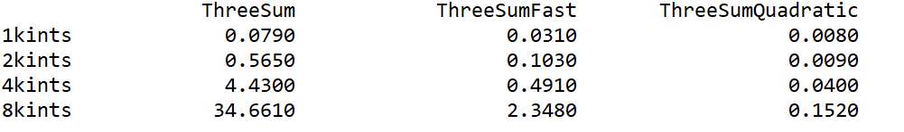

## Analysis Of Algorithm

### Interview Questions: Analysis of Algorithms (ungraded)

**1. 3-SUM in quadratic time.** 

Design an algorithm for the 3-SUM problem that takes time proportional to $n^2$ in the worst case. You may assume that you can sort the $n$ integers in time proportional to $n^2$ or better.

*Note: these interview questions are ungraded and purely for your own enrichment. To get a hint, submit a solution.*

**Solution**

在课程中已经给出了两个求解 3-SUM 问题的算法：暴力方法 `ThreeSum` 和改进算法 `ThreeSumFast`。

其中暴力方法 `ThreeSum` 的时间复杂度为 $O(N^3)$，改进算法 `ThreeSumFast` 的时间复杂度为 $O(N^2logN)$。

题目要求我们再实现一种求解 3-SUM 问题的算法 `ThreeSumQuadratic`，要求其时间复杂度为 $O(N^2)$。

分析 `ThreeSumFast`，虽然其对数组 `a` 进行排序，但排序后，仍然需要对一堆二元整数组 `(a[i], a[j])` 做关于其和的负数 `-(a[i]+a[j])` 的 `BinarySearch`，这堆二元整数组有 $\sim\frac{1}{2}N^2$ 多个，这意味着我们要做 $\sim \frac{1}{2}N^2$ 次 `BinarySearch`。

> - **我们说时间复杂度一般是指 Big-Oh：$O$。**
> - 排序的时间复杂度可以是 $O(NlogN)$ 也可以是 $O(N^2)$，取决于排序算法。但显然，在 `FastThreeSum` 中，在一堆二元组上做 `BinarySearch` 才是主要操作。

我们需要摆脱二元整数组，否则时间复杂度不可能降低到 $O(N^2)$，方法如下：

```java
import java.util.Arrays;

import edu.princeton.cs.algs4.In;
import edu.princeton.cs.algs4.StdOut;
import edu.princeton.cs.algs4.Stopwatch;

public class ThreeSumQuadratic {
	
	public static int count(int[] a) {
		Arrays.sort(a);
		int N = a.length;
		int count = 0;
		
		for (int i = 0; i < N - 2; i++) {
			int j = i + 1;
			int k = N - 1;
			
			while (j < k) {
				int sum = a[i] + a[j] + a[k];
				if (sum < 0) {
					j++;
				}
				else if (sum > 0) {
					k--;
				}
				else {
					count++;
					j++;
				}
			}

		}
		
		return count;
	}

	public static void main(String[] args) {
		int[] a = new In(args[0]).readAllInts();
		Stopwatch stopwatch = new Stopwatch();
		StdOut.println(count(a));
		double time = stopwatch.elapsedTime();
		StdOut.println(time);
	}
	
}
```

只要排序算法的时间复杂度低于 $O(N^2)$，以上做法即满足需求。

**效果对比（`ThreeSumFast` 和 `ThreeSumQuadratic` 使用相同的排序算法）：**




**2. Search in a bitonic array.** 

An array is **bitonic (双调)** if it is comprised of an increasing sequence of integers followed immediately by a decreasing sequence of integers. Write a program that, given a bitonic array of $n$ distinct integer values, determines whether a given integer is in the array.

- Standard version: Use $\sim 3\lg n$ compares in the worst case.
- Signing bonus: Use $\sim 2\lg n$ compares in the worst case (and prove that no algorithm can guarantee to perform fewer than $\sim 2\lg n$ compares in the worst case).

```
package analysis_of_algs;

import com.rqtn.algs.chapter1_1.BinarySearch;

public class BitonicSearch {

	public static int recursiveRank(int key, int[] a) {
		return recursiveRank(key, a, 0, a.length-1);
	}
	
	public static int recursiveRank(int key, int[] a, int lo, int hi) {
		
		if (lo > hi) return -1;
		int mid = lo + (hi - lo) / 2;
		if (a[mid] == key) return mid;
		
		int res1 = 0;
		int res2 = 0;
		
		if (a[mid] > a[mid+1]) {
			if (a[mid] > key) {
				res2 = BinarySearch.recursiveReverseRank(key, a, mid+1, hi);
			} else {
				return recursiveRank(key, a, lo, mid-1);
			}
			if (res2 == -1) {
				return recursiveRank(key, a, lo, mid-1);
			}
			else return res2;
		}
		else {
			// a[mid] < a[mid+1]
			if (a[mid] > key) {
				res1 = BinarySearch.recursiveRank(key, a, lo, mid-1);
			} else {
				return recursiveRank(key, a, mid+1, hi);
			}
			if (res1 == -1) {
				return recursiveRank(key, a, mid+1, hi);
			}
			else return res1;
		}
	}

	public static void main(String[] args) {
        int[] a = {1, 2, 3, 4, 5, 6, 29, 28, 27, 23, 22, 19, 17, 16, 15, 14, 13, 12, 11, 10, 9, 8, 7};
        
        for (int i = 0; i < 50; i++) {
            boolean b = recursiveRank(i, a) == -1 ? false : true;
            System.out.println(i + " is in array? " + b);
        }
        
    }
	
	
}

```


**3. Egg drop.** 

Suppose that you have an $n$-story building (with floors $1$ through $n$) and plenty of eggs. An egg breaks if it is dropped from floor $T$ or higher and does not break otherwise. Your goal is to devise a strategy to determine the value of $T$ given the following limitations on the number of eggs and tosses:

- Version 0: $1$ egg,  $\le T$ tosses.
- Version 1: $\sim1\lg n$ eggs and  $\sim1\lg n$ tosses.
- Version 2: $\sim\lg T$ eggs and  $\sim2\lg T$ tosses.
- Version 3: $2$ eggs and $\sim2\sqrt{n}$ tosses.
- Version 4: $2$ eggs and $\le c \sqrt T$ tosses for some fixed constant $c$.


