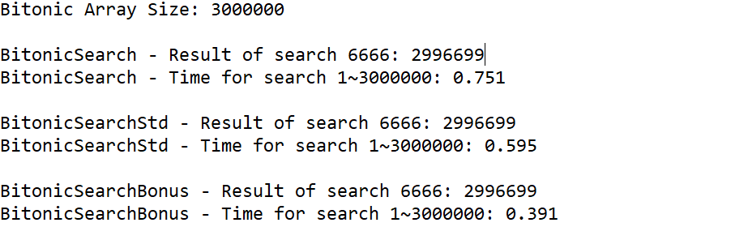

## Analysis Of Algorithm

### Interview Questions: Analysis of Algorithms (ungraded)

**1. 3-SUM in quadratic time.** 

Design an algorithm for the 3-SUM problem that takes time proportional to $n^2$ in the worst case. You may assume that you can sort the $n$ integers in time proportional to $n^2$ or better.

*Note: these interview questions are ungraded and purely for your own enrichment. To get a hint, submit a solution.*

**Solution**

在课程中已经给出了两个求解 3-SUM 问题的算法：暴力方法 `ThreeSum` 和改进算法 `ThreeSumFast`。

其中暴力方法 `ThreeSum` 的时间复杂度为 $O(N^3)$，改进算法 `ThreeSumFast` 的时间复杂度为 $O(N^2logN)$。

题目要求我们再实现一种求解 3-SUM 问题的算法 `ThreeSumQuadratic`，要求其时间复杂度为 $O(N^2)$。

分析 `ThreeSumFast`，虽然其对数组 `a` 进行排序，但排序后，仍然需要对一堆二元整数组 `(a[i], a[j])` 做关于其和的负数 `-(a[i]+a[j])` 的 `BinarySearch`，这堆二元整数组有 $\sim\frac{1}{2}N^2$ 多个，这意味着我们要做 $\sim \frac{1}{2}N^2$ 次 `BinarySearch`。

> **Note**：
>
> **我们说时间复杂度一般是指 Big-Oh：$O$。**
>
> 排序的时间复杂度可以是 $O(NlogN)$ 也可以是 $O(N^2)$，取决于排序算法。但显然，在 `FastThreeSum` 中，在一堆二元组上做 `BinarySearch` 才是主要操作。

我们需要摆脱二元整数组，否则时间复杂度不可能降低到 $O(N^2)$，方法如下：

```java
package analysis_of_algs;

import java.util.Arrays;

import edu.princeton.cs.algs4.In;
import edu.princeton.cs.algs4.StdOut;
import edu.princeton.cs.algs4.Stopwatch;

public class ThreeSumQuadratic {
	
	public static int count(int[] a) {
		Arrays.sort(a);
		int N = a.length;
		int count = 0;
		
		for (int i = 0; i < N - 2; i++) {
			int j = i + 1;
			int k = N - 1;
			
			while (j < k) {
				int sum = a[i] + a[j] + a[k];
				if (sum < 0) {
					j++;
				}
				else if (sum > 0) {
					k--;
				}
				else {
					count++;
					j++;
				}
			}

		}
		
		return count;
	}

	public static void main(String[] args) {
		int[] a = new In(args[0]).readAllInts();
		Stopwatch stopwatch = new Stopwatch();
		StdOut.println(count(a));
		double time = stopwatch.elapsedTime();
		StdOut.println(time);
	}
	
}
```

只要排序算法的时间复杂度低于 $O(N^2)$，以上代码的方法即满足需求。

**效果对比（`ThreeSumFast` 和 `ThreeSumQuadratic` 使用相同的排序算法）：**


**2. Search in a bitonic array.** 

An array is **bitonic (双调)** if it is comprised of an increasing sequence of integers followed immediately by a decreasing sequence of integers. Write a program that, given a bitonic array of $n$ distinct integer values, determines whether a given integer is in the array.

- Standard version: Use $\sim 3\lg n$ compares in the worst case.
- Signing bonus: Use $\sim 2\lg n$ compares in the worst case (and prove that no algorithm can guarantee to perform fewer than $\sim 2\lg n$ compares in the worst case).

**Solution**

这里将列出三种算法。

* 首先是我想到的算法（算法一 `BitonicSearch`），我想当然地以为算法一是 $\sim2\lg n$ 的，实际上，算法一的性能是最差的，其时间复杂度为 $O(\lg^2N)$。思路如下：

  * 寻找数组的中间点 `mid`

  * 确定 `a[mid]` 附近的排序情况，是降序还是升序（等价于确定最大值是在 `a[mid]` 的左边还是右边）

  * 确定 `key` 与 `a[mid]` 的大小情况

  * 如果是降序，那么显然 `a[mid]~a[hi]` 都是降序，此时：

    * 若 `key` 比 `a[mid]` 要小，那么 `key` 可能在 `a[mid]~a[hi]` 中，也可能在 `a[lo]~a[mid]` 中。

      对于 `a[mid]~a[hi]`，其为降序数组，使用 `BinarySearch`，找到则返回，否则再到 `a[lo]~a[mid]` 中寻找，显然 `a[lo]~a[mid]` 是一个更小的双调数组，可递归求解。

    * 若 `key` 比 `a[mid]` 要大，那么 `key` 只可能在 `a[lo]~a[mid]` 中，可递归求解。

  * 如果是升序，那么显然 `a[lo]~a[mid]` 都是升序，此时：

    * 若 `key` 比 `a[mid]` 要小，那么 `key` 可能在 `a[lo]~a[mid]` 中，也可能在 `a[mid]~a[hi]` 中。

      对于 `a[lo]~a[mid]`，其为升序数组，使用 `BinarySearch`，找到则返回，否则再到 `a[mid]~a[hi]` 中寻找，显然 `a[mid]~a[hi]` 是一个更小的双调数组，可递归求解。

    * 若 `key` 比 `a[mid]` 要大，那么 `key` 只可能在 `a[mid]~a[hi]` 中，可递归求解。

  网上:surfer: 发现，其实也有很多人和我一样把算法一想当然地认为是 $\sim2\lg N$ 的，对于其时间复杂度为 $O(\lg^2N)$ 的解释参考：[StackOverflow - Given a bitonic array and element x in the array, find the index of x in 2log(n) time](https://stackoverflow.com/questions/19372930/given-a-bitonic-array-and-element-x-in-the-array-find-the-index-of-x-in-2logn)。代码如下：

  ```java
  package analysis_of_algs;
  
  import edu.princeton.cs.algs4.StdOut;
  
  public class BitonicSearch {
  	
  	private static int leftBinarySearch(int[] a, int key, int lo, int hi) {
  		while (lo <= hi) {
  			int mid = lo + (hi - lo) / 2 ;
  			if (key < a[mid]) hi = mid - 1;
  			else if (key > a[mid]) lo = mid + 1;
  			else return mid;
  		}
  		return -1;
  	}
  	
  	private static int rightBinarySearch(int[] a, int key, int lo, int hi) {
  		while (lo <= hi) {
  			int mid = lo + (hi - lo) / 2;
  			if (key > a[mid]) hi = mid - 1;
  			else if (key < a[mid]) lo = mid + 1;
  			else return mid;
  		}
  		return -1;
  	}
  	
  	public static int find(int[] a, int key) {
  		return find(a, key, 0, a.length-1);
  	}
  	
  	private static int find(int[] a, int key, int lo, int hi) {
  		
  		if (lo > hi) return -1;
  		int mid = lo + (hi - lo) / 2;
  		if (a[mid] == key) return mid;
  		
  		int rbResult = 0;
  		int lbResult = 0;
  		
  		// if a[mid] nearby is descending order
  		if (a[mid] > a[mid+1]) {
  			// if a[mid] > key, rightBinarySearch on a[mid+1]~a[hi]  
  			if (a[mid] > key) {
  				rbResult = rightBinarySearch(a, key, mid+1, hi);
  				// if rightBinarySearch not find, then key also may on a[lo]~a[mid-1]
  				if (rbResult == -1) {
  					return find(a, key, lo, mid-1);
  				} 
  				else return rbResult;
  			}
  			// else a[mid] < key, then key only possible on a[lo]~a[mid-1]
  			else {
  				return find(a, key, lo, mid-1);
  			}
  		}
  		// else a[mid] nearby is ascending order
  		else {
  			// if a[mid] > key, leftBinarySearch on a[lo]~a[mid-1]
  			if (a[mid] > key) {
  				lbResult = leftBinarySearch(a, key, lo, mid-1);
  				// if leftBinarySearch not find, then key also may on a[mid+1]~a[hi]
  				if (lbResult == -1) {
  					return find(a, key, mid+1, hi);
  				}
  				else return lbResult;
  			}
  			// else a[mid] < key, then key only possible on a[mid+1]~a[hi]
  			else {
  				return find(a, key, mid+1, hi);
  			}
  		}
  	}
  
  	public static void main(String[] args) {
  		
          int[] a = {1, 2, 3, 4, 5, 6, 29, 28, 27, 23, 22, 19, 17, 16, 15, 14, 13, 12, 11, 10, 9, 8, 7};
          
          for (int i = 0; i < 31; i++) {
          	int ret = find(a, i);
              StdOut.println(i + " : " + (ret == -1 ? "not find" : "find at " + ret));
          }
          
      }
  	
  }
  ```

* 其次是算法二 `BitonicSearchStd`，也即题目中要求的 Standard version，$\sim 3\lg N$ 的比较数。

  算法二的思想很简单，先采用 `BinarySearch` 的变式把最大值给找到，这在 worst case 下是 $\sim \lg N$ 的比较数，然后对最大值的左半边和右半边分别使用 `BinarySearch`，左右各有 $2\lg \frac{N}{2}=\lg N-2=\sim\lg N$ 的比较数，故总共有 $\sim 3\lg N$ 的比较数。

  代码如下：

  ```java
  package analysis_of_algs;
  
  import edu.princeton.cs.algs4.StdOut;
  
  public class BitonicSearchStd {
  	
  	private static int leftBinarySearch(int[] a, int key, int lo, int hi) {
  		while (lo <= hi) {
  			int mid = lo + (hi - lo) / 2 ;
  			if (key < a[mid]) hi = mid - 1;
  			else if (key > a[mid]) lo = mid + 1;
  			else return mid;
  		}
  		return -1;
  	}
  	
  	private static int rightBinarySearch(int[] a, int key, int lo, int hi) {
  		while (lo <= hi) {
  			int mid = lo + (hi - lo) / 2;
  			if (key > a[mid]) hi = mid - 1;
  			else if (key < a[mid]) lo = mid + 1;
  			else return mid;
  		}
  		return -1;
  	}
  	
  	private static int findMaxIndex(int[] a) {
  		int lo = 0;
  		int hi = a.length - 1;
  		while (lo < hi) {
  			int mid = lo + (hi - lo) / 2;
  			if (a[mid] > a[mid+1]) {
  				hi = mid;
  			} else {
  				lo = mid + 1;
  			}
  		}
  		return hi;
  	}
  	
  	public static int find(int[] a, int key) {
  		int lo = 0;
  		int hi = a.length - 1;
  		int maxIndex = findMaxIndex(a);
  		
  		if (key == a[maxIndex]) return maxIndex;
  		
  		int lbResult = leftBinarySearch(a, key, lo, maxIndex - 1);
  		if (lbResult != -1) return lbResult;
  		
  		int rbResult = rightBinarySearch(a, key, maxIndex + 1, hi);
  		if (rbResult != -1) return rbResult;
  		
  		return -1;
  	}
  	
  	public static void main(String[] args) {
  		
          int[] a = {1, 2, 3, 4, 5, 6, 29, 28, 27, 23, 22, 19, 17, 16, 15, 14, 13, 12, 11, 10, 9, 8, 7};
          
          for (int i = 0; i < 31; i++) {
          	int ret = find(a, i);
              StdOut.println(i + " : " + (ret == -1 ? "not find" : "find at " + ret));
          }
          
      }
  	
  }
  ```

> **Note**：
>
> 算法一和算法二中使用的 `leftBinarySearch` 和 `rightBinarySearch` 都是课程中所说的 "3-way compare" 实现，也即有 2 次比较，程序流有 3 路分支。所以，算法二中对左右半边进行 `BinarySearch` 比较数为 $2\lg \frac{N}{2}$ 而非 $\lg\frac{N}{2}$。**在算法三中，将给出 "2-way compare" 实现 `leftSearch` 和 `rightSearch`（一般我们还是会用更加直观的 "3-way compare"）**。
>
> 此外，我们在查看 `a[mid]` 附近的情况时，一般用 `a[mid+1]` 而非 `a[mid-1]`，因为在 `while(lo < hi)` 的前提下，`a[mid+1]` 总是存在的，而 `a[mid-1]` 我们需要额外检查 `mid-1` 下标的合法性。

* 最后是算法三 `BitonicSearchBonus`，也即题目中要求的 bonus，$\sim 2\lg N$ 的比较数。

  综合算法一和算法三，容易想到**去掉寻找最大值**的过程。

  事实上，算法三和算法一只有一个关键的地方有不同，就 `a[mid]` 附近是降序的情况而言，算法一是：

  > 若 `key` 比 `a[mid]` 要小，那么 `key` 可能在 `a[mid]~a[hi]` 中，也可能在 `a[lo]~a[mid]` 中。
  >
  > 对于 `a[mid]~a[hi]`，其为降序数组，使用 `BinarySearch`，找到则返回，否则再到 `a[lo]~a[mid]` 中寻找，显然 `a[lo]~a[mid]` 是一个更小的双调数组，可递归求解。

  关键的地方就在后者，`a[lo]~a[mid]` 我们知道是一个相对更小的双调数组（对应下图中的蓝色和黑色部分），故在算法一中，我们将其视为子问题递归求解。

  而实际上，**当 `key < a[mid]` 时（也即要寻找的 `key` 值位于蓝色部分时），我们可以直接在 `a[lo]~a[mid]` 这个双调数组上使用 `BinarySearch` 并得到正确的结果** 。

  这就是算法三的关键思想：对于一个双调数组，如果你要寻找的 `key` 值位于 `a[lo]` 和 `a[hi]` 之间，那么直接使用 `BinarySearch` 是正确的。

  

  好了，对于 `key < a[mid]` 的情况，`key` 在两边都有可能存在（蓝色和红色部分），我们直接对两边进行 `BinarySearch` 就好了，即使其中一边是双调数组，此时有 $\sim 2\lg N$ 的比较数。

  那对于 `key > a[mid]` 的情况，`key` 处于黑色部分，我们只需要根据 `a[mid]` 附近的情况进行范围缩小即可。比如若我们要找到 `key` 是上图中的绿点，由于 `a[mid]` 附近是降序（说明 `key` 位于 `mid` 的左边），显然此时 `key` 只可能存在于左边 `a[lo]~a[mid]`，此时令 `hi=mid-1` 。依次类推，不断重复地缩小范围，使转换到 `key < a[mid]` 的情况，然后就能对两边 `BinarySearch` 进行求解。

  如果要寻找的 `key` 特别大（比数组中的所有元素都大），那么此时有 $\sim \lg N$ 的比较数。一般地，假设 `k` 次缩小范围，则有：$$k+2\lg \frac{N}{2^{k+1}}=k+2(\lg N - (k+1))=2\lg N-k-2=\sim \lg N$$。

  代码如下（注意其中 `BinarySearch` 的 "2-way compare" 实现）：

  ```java
  package analysis_of_algs;
  
  import edu.princeton.cs.algs4.StdOut;
  
  public class BitonicSearchBonus {
  
  	private static int leftSearch(int[] a, int key, int lo, int hi) {
  		while (lo < hi) {
  			int mid = lo + (hi - lo) / 2;
  			if (key <= a[mid]) {
  				hi = mid;
  			}
  			else {
  				lo = mid + 1;
  			}
  		}
  		if (key == a[lo]) return lo;
  		else return -1;
  	}
  	
  	private static int rightSearch(int[] a, int key, int lo, int hi) {
  		while (lo < hi) {
  			int mid = lo + (hi - lo) / 2;
  			if (key >= a[mid]) {
  				hi = mid;
  			}
  			else {
  				lo = mid + 1;
  			}
  		}
  		if (key == a[lo]) return lo;
  		else return -1;
  	}
  	
  	public static int find(int[] a, int key) {
  		int lo = 0;
  		int hi = a.length - 1;
  		while (lo < hi) {
  			int mid = lo + (hi - lo) / 2;
  			if (key == a[mid]) return mid;
  			if (key < a[mid]) {
  				int lbResult = leftSearch(a, key, lo, mid);
  				if (lbResult != -1) {
  					return lbResult;
  				} 
  				else return rightSearch(a, key, mid, hi);
  			}
  			else {
  				if (a[mid] < a[mid+1]) {
  					lo = mid + 1;
  				} 
  				else {
  					hi = mid - 1;
  				}
  			}
  		}
  		return -1;
  	}
  	
  	public static void main(String[] args) {
  		
          int[] a = {1, 2, 3, 4, 5, 6, 29, 28, 27, 23, 22, 19, 17, 16, 15, 14, 13, 12, 11, 10, 9, 8, 7};
          
          for (int i = 0; i < 31; i++) {
          	int ret = find(a, i);
              StdOut.println(i + " : " + (ret == -1 ? "not find" : "find at " + ret));
          }
          
      }
  }
  ```

**效果对比**




**3. Egg drop.** 

Suppose that you have an $n$-story building (with floors $1$ through $n$) and plenty of eggs. An egg breaks if it is dropped from floor $T$ or higher and does not break otherwise. Your goal is to devise a strategy to determine the value of $T$ given the following limitations on the number of eggs and tosses:

- Version 0: $1$ egg,  $\le T$ tosses.
- Version 1: $\sim1\lg n$ eggs and  $\sim1\lg n$ tosses.
- Version 2: $\sim\lg T$ eggs and  $\sim2\lg T$ tosses.
- Version 3: $2$ eggs and $\sim2\sqrt{n}$ tosses.
- Version 4: $2$ eggs and $\le c \sqrt T$ tosses for some fixed constant $c$.


